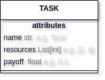
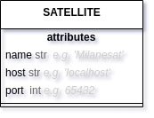

# Satellogic challenge

Simulation of satellite fleet tasking.

## Installation

```bash
~$ git clone https://github.com/brivadeneira/satellogic-challenge && cd satellogic-challenge
~/satellogic-challenge$ pip install -r requirements.txt
```

## Usage

```bash
~/satellogic-challenge$ make all LOG_LEVEL=<level> N_TASKS=<n_tasks> N_RESOURCES=<n_resources> MAX_PAYOFF=<max_payoff> 
```

Where:

* `LOG_LEVEL`:  'debug', 'info', 'warn' or 'error' *('info' by default)*
* `N_TASKS`: (int) Number of *fake* tasks to build *e.g. 3* *(3 by default)*
* `N_RESOURCES`: (int) Number of resources that can require the tasks *e.g. 3* *(3 by default)*
* `MAX_PAYOFF`: (float) Maximum value of payoff for a single task *e.g. 10* *(10 by default)*

> All parameters are optional, if any of them is not given, default values will be used.

```bash
~/satellogic-challenge$ make all LOG_LEVEL=debug N_TASKS=5 N_RESOURCES=5 MAX_PAYOFF=20 

cd satellites && python milanesat.py &
cd satellites && python hamburguesat.py &
python main.py debug 5 5 20
INFO:root:2022-04-04 00:29:38.180206:from ground station:above, provide, personal, plant, total task(s) to manage
DEBUG:root:2022-04-04 00:29:38.180414:from ground station:above task has a payoff of 4.77 and needs 3 and 2 resources
DEBUG:root:2022-04-04 00:29:38.180547:from ground station:provide task has a payoff of 19.84 and needs 4 and 5 resources
DEBUG:root:2022-04-04 00:29:38.180673:from ground station:personal task has a payoff of 18.06 and needs 4 and 2 resources
DEBUG:root:2022-04-04 00:29:38.180802:from ground station:plant task has a payoff of 14.05 and needs 3 and 4 resources
DEBUG:root:2022-04-04 00:29:38.180925:from ground station:total task has a payoff of 13.23 and needs 2 and 3 resources
DEBUG:root:2022-04-04 00:29:38.181335:from ground station:above, provide, personal task(s) will be assign making a total of 42.67 payoff
DEBUG:root:2022-04-04 00:29:38.181435:from ground station:plant, total task(s) wont be assign
INFO:root:2022-04-04 00:29:38.181590:from ground station:Trying to connect with Milanesat in 127.0.0.1:65432
INFO:root:2022-04-04 00:29:38.181813:from ground station:Connection established with Milanesat in 127.0.0.1:65432
INFO:root:2022-04-04 00:29:38.181916:from ground station:Sending provide, above task(s) to Milanesat in 127.0.0.1:65432
DEBUG:root:2022-04-04 00:29:38.182267:from ground station:Milanesat has completed above, provide task(s) 
INFO:root:2022-04-04 00:29:38.182419:from ground station:Trying to connect with Hamburguesat in 127.0.0.1:65433
INFO:root:2022-04-04 00:29:38.182553:from ground station:Connection established with Hamburguesat in 127.0.0.1:65433
INFO:root:2022-04-04 00:29:38.182677:from ground station:Sending personal task(s) to Hamburguesat in 127.0.0.1:65433
DEBUG:root:2022-04-04 00:29:39.184378:from ground station:Hamburguesat has completed personal task(s) 
INFO:root:2022-04-04 00:29:39.185008:from ground station:above, provide, personal task(s) has been completed
WARNING:root:2022-04-04 00:29:39.185273:from ground station:plant, total task(s) has not been allocated as a result of payoff optimization
```

## Description

A fleet ot **two** satellites which receives tasks from a single ground station is simulated as three different Python processes as below: 

  
*Socket communication diagram*

### Tasks

Task abstraction *(as a Python object from the ground station)* can be shown here:

  
*Task class*

#### Tasks simulation

A batch of tasks is built using the [faker](https://faker.readthedocs.io/en/master/#) library for the names *(that must be unique)*, and random numbers for the resources that each one requires and the payoff.

### Satellites 🛰
```bash
├── satellites
│   ├── satellite.py
```  
Satellite abstraction *(as a Python object from the ground station)* can be shown here:

  
*Satellite class*

Each satellite is a socket server process listening for tasks to solve.
When a batch of tasks arrives, they take a random time to solve it.

> It has a 10% chance of fail trying to solve a task.

It sends back a message with the result of solving tasks through the socket connection.

Two satellites have exactly the same behaviour:
```bash
├── satellites
│   ├── hamburguesat.py
│   ├── milanesat.py
```

### Ground station 📡

Its abstraction is conformed by a socket client process which sends the tasks assigned to every single satellite throught the corresponding socket server.

In addition to all logic related to: 
- assign the required tasks according to their **payoff optimization**
- connect and send them through the corresponding socket connection
- log events

### Payoff optimization

In order to maximize the payoff of the batch of tasks to assign:

```python
from utils.utils import build_fake_tasks

tasks_to_assign = build_fake_tasks()
print(tasks_to_assign)
```

```json
{"trouble": {"resources": [2, 3], "payoff": 3.85},
  "one": {"resources": [2, 3], "payoff": 1.99},
  "public": {"resources": [1, 2], "payoff": 1.94}}
```

- *All* possible combination of tasks in three *(number of sat + 1)* groups is determined:
  - Tasks designated to the first satellite *(Milanesat)*
  - Tasks designated to the second satellite *(Hamburguesat)*
  - Tasks that without designation.
  - First two groups are the groups of interest from here:

```python
from utils.tasks_optimization import *

all_task_combinations = get_all_tasks_combinations([task for task in tasks_to_assign])
print(all_task_combinations)

[
  [['hard'], ['national']], 
  [['hard'], ['national', 'represent']], 
  [['hard'], ['represent']], 
  [['hard', 'national'], ['represent']], 
  [['national'], ['hard', 'represent']], 
  [['national'], ['represent']]
]
```
- Optimizer works now with the subset of combination that *are possible* according to resources required:

```python
tasks_resources = {
    task: tasks_to_assign[task]["resources"] for task in tasks_to_assign
}
tasks_payoff = {name: tasks_to_assign[name]["payoff"] for name in tasks_to_assign}


possible_combinations = get_possible_task_combinations(
        all_task_combinations, tasks_resources
)

print(possible_combinations)

[
  [['trouble'], ['one']], 
  [['trouble'], ['public']], 
  [['one'], ['public']]
]
```

* It sorts the possible combinations by accumulated payoff for each group of two sets of tasks:

```python
combination_payoff = {}

for combination in possible_combinations:
    total_payoff = 0
    for pair in combination:
        total_payoff += sum([tasks_payoff[task] for task in pair])
    combination_payoff[round(total_payoff, 2)] = combination

sorted(combination_payoff.items(), reverse=True)

[(5.84, [['trouble'], ['one']]),
 (5.79, [['trouble'], ['public']]),
 (3.93, [['one'], ['public']])]
```

* And finally it finds the best combination of tasks that maximize the payoff:
  * 'trouble' task for Milanesat
  * 'one' task for Hamburguesat
  * 'public' task is not going to be assigned

## License

[MIT](https://choosealicense.com/licenses/mit/)

## TODO

- [ ] Add tests
- [ ] Dockerize